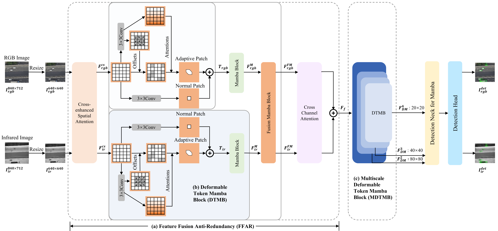
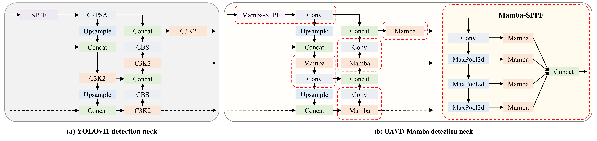

# [IV 2025] UAVD-Mamba: Deformable Token Fusion Vision Mamba for Multimodal UAV Detection
<div align="center">

[](https://arxiv.org/abs/2507.00849)
[](https://ieeexplore.ieee.org/abstract/document/11097569)

</div>

1. The core of Deformable Token


2. The overview of UAVD-Mamba


3. UAVD-Mamba detection neck


4. Detection results on DroneVehicle dataset


This repository contains the code for the paper [UAVD-Mamba: Deformable Token Fusion Vision Mamba for Multimodal UAV Detection](https://ieeexplore.ieee.org/document/11097442).
>  - [2025 IEEE Intelligent Vehicles Symposium (IV) Paper](https://ieeexplore.ieee.org/abstract/document/11097569), IEEE IV 2025 

## Datasets

 * DroneVehicle 

### Dataset Organization Format

```bash
datasets/
├── 📁 train/
│   ├── 🖼️ images/
│   │   ├── 00001.jpg
│   │   └── ...
│   └── 📄 labels/
│       ├── 00001.txt
│       └── ...
├── 📁 train2/
│   ├── 🖼️ images/
│   └── 📄 labels/
├── 📁 val/
│   ├── 🖼️ images/
│   └── 📄 labels/
└── 📁 val2/
    ├── 🖼️ images/
    └── 📄 labels/
```

## Setup
1. Clone the repository:
  ```bash
  git clone https://github.com/GreatPlum-hnu/UAVD-Mamba.git
  ```

2. Create and activate the Conda environment:
  ```bash
  conda env create -f environment.yml
  ```

3. Navigate to the `ultralytics/Vim/` directory:
  ```bash
  cd ultralytics/Vim/
  ```

  - Install requirements from `vim_requirements.txt`:
    ```bash
    pip install -r vim/vim_requirements.txt
    ```

  - Install `causal_conv1d` and `mamba`:
    ```bash
    pip install -e causal_conv1d>=1.1.0
    pip install -e mamba-1p1p1
    ```

4. Train the model:
  ```bash
  python train.py
  ```

5. Validate the model:
  ```bash
  python val.py
  ```

## Citation

If you find our repo or our paper useful, please use the following citation:

```
@INPROCEEDINGS{11097442,
  author={Li, Wei and Tang, Jiaman and Li, Yang and Xia, Beihao and Tan, Ligang and Qin, Hongmao},
  booktitle={2025 IEEE Intelligent Vehicles Symposium (IV)}, 
  title={UAVD-Mamba: Deformable Token Fusion Vision Mamba for Multimodal UAV Detection}, 
  year={2025},
  volume={},
  number={},
  pages={561-568},
  keywords={Convolutional codes;YOLO;Measurement;Shape;Intelligent vehicles;Redundancy;Object detection;Feature extraction;Autonomous aerial vehicles;Neck},
  doi={10.1109/IV64158.2025.11097442}}
```

## Acknowledgements

Our code is based on several repositories:
- [YOLO](https://github.com/ultralytics/ultralytics.git)
- [Vim](https://github.com/hustvl/Vim.git)
- [FusionMamba](https://github.com/PSRben/FusionMamba.git)
- [DCN](https://github.com/yjh0410/PyTorch_DCNv2.git)